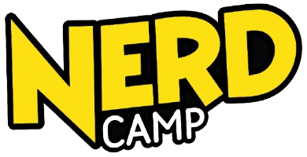

# Hej -ers!

Velkommen til vores helt egen GitHub-side! Her deler vi kode og ideer. Kun for
os campere og voksne!

## Regler

Her er nogle enkle regler, vi alle skal følge:

1. **Vær sød og venlig:** Tal pænt til hinanden, og vær rar. Ingen må mobbe
eller være ondskabsfuld.
2. **Ingen grimme ord:** Brug ikke bandeord eller andre stødende ord. Hold
sproget pænt og hyggeligt.
3. **Pas på dine oplysninger:** Del aldrig dine rigtige oplysninger som dit
fulde navn, adresse eller telefonnummer med fremmede på internettet.
4. **Ingen upassende indhold:** Del kun billeder og videoer, som er passende for
alle aldre. Ingen voldelige eller uhyggelige ting er tilladt.
5. **Lyt til dem, der administrerer organisationen:** Administratorerne er her
for at hjælpe og sørge for, at alt fungerer godt. Hvis de beder dig om noget, så
respekter det.
Hvis de siger noget, så skal du lytte til dem.
6. **Ingen spam:** Send ikke de samme beskeder eller billeder mange gange. Hold
samtalerne sjove og relevante.
7. **Fortæl, hvis der er problemer:** Hvis du ser nogen opføre sig dårligt eller
bryde reglerne, så ping en admin i en kommentar eller kontakt dem direkte.
8. **Hav det sjovt!** Vi vil gerne have, at alle har det sjovt her, så husk at
følge reglerne!

## Administratorer

Her er administratorernes GitHub og Discord:

* [viktorpopp] ([@viktorpopp])

[ViktorPopp]: https://github.com/ViktorPopp
[@zer0developer]: https://discord.com/users/1236265571591520271
